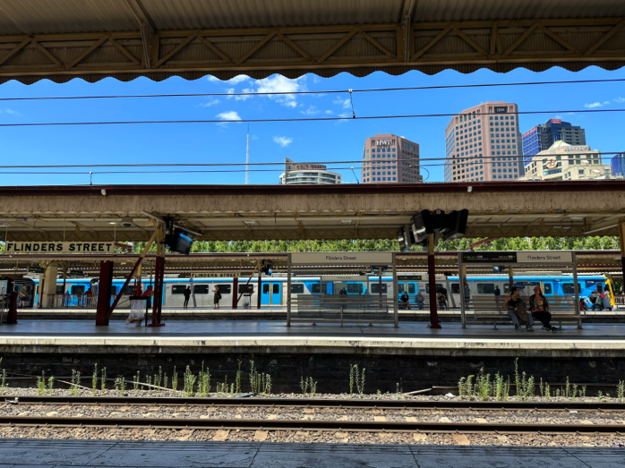
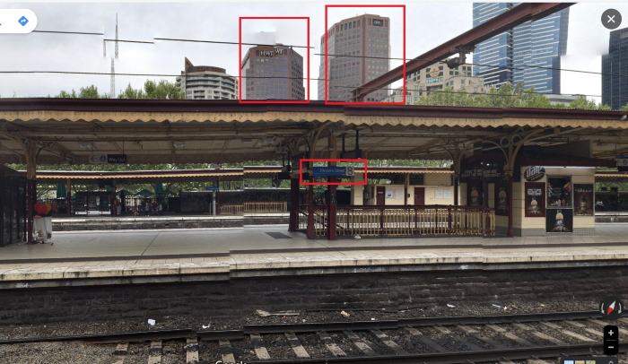
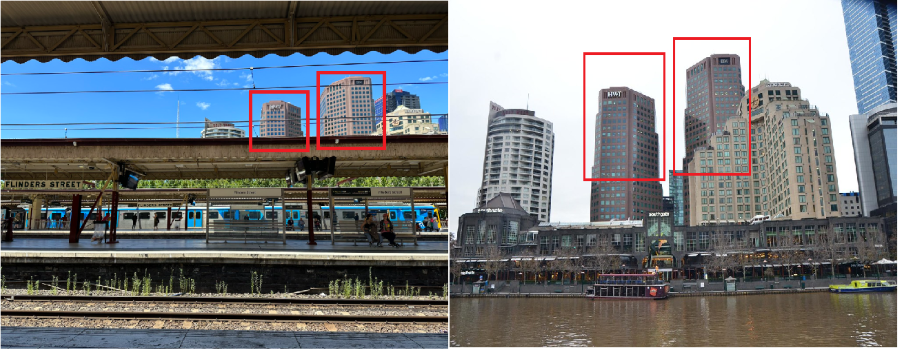
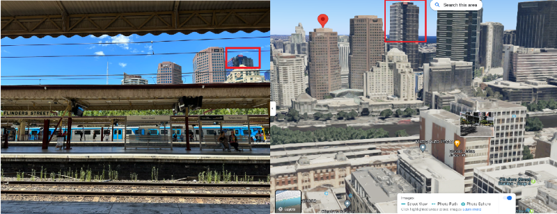

# Train Station Mystery: My first OSINT Challenge  
## Osint Report
**Author**: D'Vanshi
**Date**: 21-06-2024  
**Challenge Author**: Sofia Santos  

---

## Introduction

This report presents an open-source intelligence (OSINT) investigation undertaken as part of a public challenge issued by OSINT specialist Sofia Santos. The objective of the challenge was to analyze a publicly shared photograph and determine:

- The name of the train station seen in the image  
- The name and height of the tallest structure seen in the photo  

---

## Tools & Techniques Utilized

- Google Reverse Image Search  
- Google Maps   
- Traditional Search Engines  

---

## Methodology & Investigation Steps

The investigation followed a structured OSINT workflow:

### 1. Initial Image Analysis
- The initial phase involved a thorough examination of the provided image. The photo revealed a sign reading "Flinders Street," providing the first crucial clue.

### 2. Train Station Identification
- Used **Google Reverse Image Search** to validate the location.
- Results strongly correlated with the **Flinders Street Railway Station**, Melbourne, Australia.
 
### 3. Street-Level Verification
- Utilized **Google Street View** to virtually navigate around the Flinders Street area, confirming architectural matches and sign placements consistent with the original photo.
  
### 4. Tallest Structure Identification
- Buildings labeled **HWT** and **IBM** were observed in the background.
- While the IBM building initially appeared to be the tallest, a deeper investigation was conducted.
- **Google Maps 3D View** was used to virtually explore the area. A background building, later identified as **FOCUS Apartments**, was determined to be taller than both IBM and HWT structures.

### 5. Height Confirmation
- Verified via search engine
- **FOCUS Apartments** stands at **166 meters**.

---

## Findings

| Item                    | Details                          |
|-------------------------|----------------------------------|
| **Train Station**       | Flinders Street Railway Station  |
| **City**                | Melbourne, Australia             |
| **Tallest Structure**   | FOCUS Apartments                 |
| **Height**              | 166 meters                       |
| **Other Visible Buildings** | IBM Building, HWT Tower      |

---

## Screenshots
Street View Image of Flinders Street Railway Station

HWT and IBM buiding

Focus appartment Buiding which is taller than HWT and IBM

---

## Key Takeaways

- Visual clues, when paired with geospatial tools, can lead to accurate identifications.
- Perspective in a photo can be misleading, 3D tools helped spot the actual tallest structure.
- Even simple tools like Google Search and reverse image lookup can be highly effective in beginner OSINT challenges.

---

## Related Links

- 📖 [Full Write-up on Medium](https://medium.com/@livinghuman/train-station-mystery-my-first-osint-challenge-cd4fdc6cdd5d)  
- 🧩 [Original Challenge](https://gralhix.com/list-of-osint-exercises/osint-exercise-002/)

---
